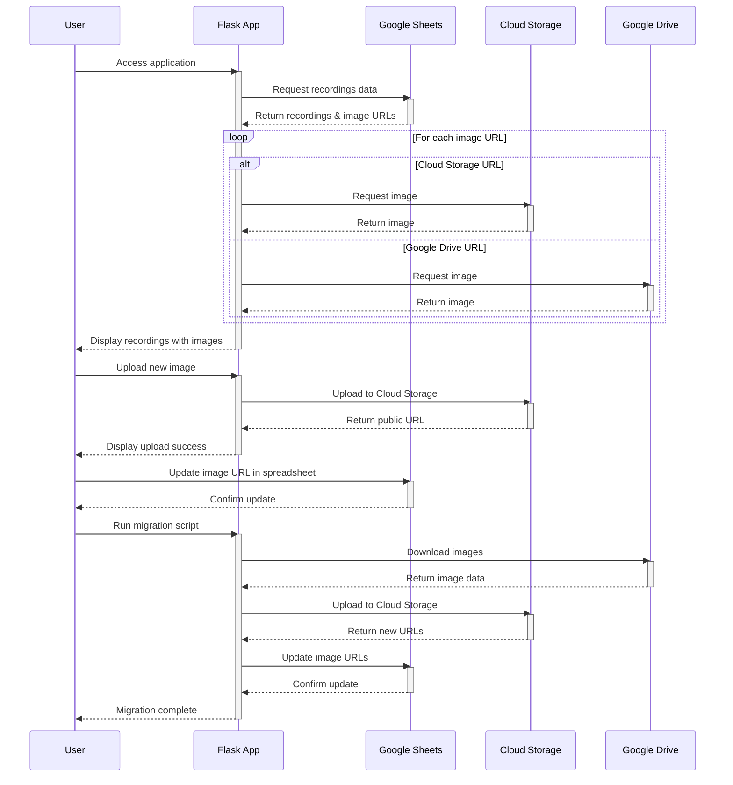

# System Architecture

## Sequence Diagram

## Component Descriptions

1. **User**: End-user accessing the application through a web browser

2. **Flask App**: Python web application that:
   - Serves web pages
   - Handles image uploads
   - Manages data retrieval and display
   - Runs migration scripts

3. **Google Sheets**:
   - Stores recording metadata
   - Contains meeting details and image URLs
   - Acts as a simple database

4. **Cloud Storage**:
   - Stores and serves images
   - Provides public URLs for images
   - Ensures fast and reliable image delivery

5. **Google Drive**:
   - Legacy storage for images
   - Source for image migration
   - Being phased out in favor of Cloud Storage

## Key Processes

### Page Load Process
1. User accesses the application
2. Flask app retrieves data from Google Sheets
3. For each image:
   - If Cloud Storage URL, fetch directly
   - If Drive URL, fetch through Drive API
4. Display complete page to user

### Image Upload Process
1. User uploads new image
2. Flask app processes and uploads to Cloud Storage
3. Cloud Storage returns public URL
4. User updates URL in Google Sheets

### Migration Process
1. User initiates migration
2. Script downloads images from Drive
3. Uploads them to Cloud Storage
4. Updates URLs in the spreadsheet
5. Confirms completion to user
